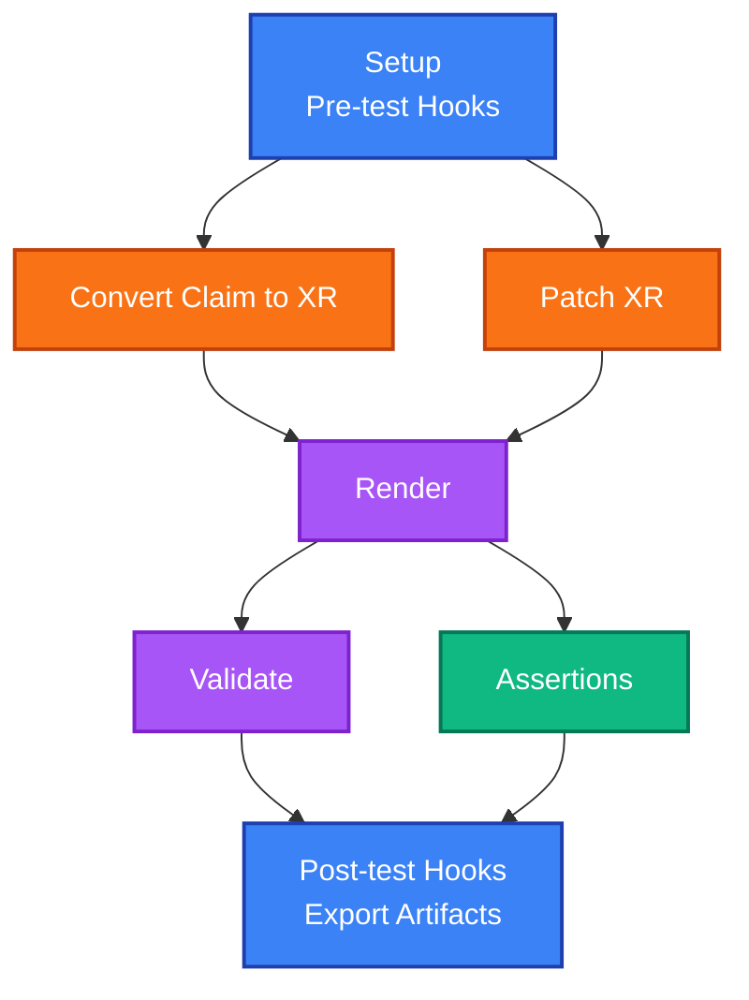

# xprin

[](https://github.com/crossplane-contrib/xprin/actions/workflows/ci.yaml) [](https://github.com/crossplane-contrib/xprin/releases)

<p align="center">
  
</p>

A Crossplane testing framework that leverages `crossplane render` and `crossplane beta validate` commands to test if Compositions render correctly against Claims or XRs, and if the rendered manifests validate against their schemas.

## Features

- **Version Agnostic**: Works with any Crossplane CLI version and supports any Composition and Function implementation
- **Local Testing**: Runs entirely locally with no running Kubernetes cluster required. Only requires a running Docker daemon for Composition Functions
- **Multiple Input Types**: Supports both XR (Composite Resource) and Claim inputs
- **XR Patching**: Apply patches on the inputs
- **Template Variables**: Dynamic content using Go template syntax
- **Hooks Support**: Pre-test and post-test shell command execution
- **Assertions**: Validate rendered resources with declarative assertions (count, existence, field checks)
- **Test Chaining**: Export testcase outputs as artifacts for use in follow-up tests to better emulate the reconciliation process
- **CI/CD Ready**: Easy integration into any system or pipeline

## FAQ

**Why was xprin created?**  
To bridge the testing gap between function-level testing and full e2e testing: you can run render and validate locally with real Compositions and Functions, without a live cluster or real resource creation.
It was originally developed by Elastic, where it is currently being used for mock/integration testing of a [large infrastructure](https://www.elastic.co/blog/journey-to-build-elastic-cloud-serverless).

**What are typical use cases?**
- **Composition testing**: Run `crossplane render` using various combinations of XRs/Claims, Compositions and Functions, and assert on the output.
- **Schema validation**: Validate various combinations of (mock or production) manifests with CRDs via `crossplane beta validate`.
- **Reconciliation emulation**: Chain tests with exported artifacts so later tests consume prior outputs (e.g. observed resources, status).
- **Advanced render inputs**: Drive render with extra resources, observed resources, additional context, environment configs, in multiple tests run one after the other.
- **Upgrades**: Validate upgrades of Crossplane itself, providers, functions before or after adoption.

**Can I test using my production XRs/Claims or data?**  
Yes. xprin runs entirely locally in a mock environment. It does not create or modify real resources; it only runs `crossplane render` and `crossplane beta validate` on the inputs you provide, so you can safely point at production data.

**What is the purpose of patching?**  
To extend coverage, by creating as many test cases we need without having to provide testdata for each one of them.

**How does it look like?**  
<details>
<summary> The testsuite files are in YAML </summary>

tests:
- name: "Successful test with hooks, validation, and assertions"
  patches:
    xrd: ../../aws/xrd.yaml
  inputs:
    xr: ../../aws/xr.yaml
    composition: ../../aws/composition.yaml
    functions: ../../aws/functions.yaml
    observed-resources: ../../aws/observed
    crds:
    - ../../aws/xrd.yaml
    - ../../aws/crossplane.yaml
  hooks:
    pre-test:
    - name: "this is a pre-test hook"
      run: echo "hello"
    post-test:
    - name: "this is a post-test hook"
      run: echo "bye"
  assertions:
    xprin:
    - name: "Number of resources"
      type: "Count"
      value: 3
    - name: "SecurityGroup should exist"
      type: "Exists"
      resource: "SecurityGroup/platform-aws-sg"
    diff:
    - name: "Full render matches golden (using diff)"
      expected: golden_full_render.yaml
</details>

<details>
<summary> The output is similar to `go test` </summary>

```
➜ xprin test simple_test_xprin.yaml -v --show-render --show-validate --show-assertions --show-hooks
=== RUN   Successful test with hooks, validation, and assertions
--- PASS: Successful test with hooks, validation, and assertions (1.31s)
    Pre-test Hooks:
        [✓] this is a pre-test hook
            hello
    Render:
        ├── XAWSInfrastructure/platform-aws
        ├── Cluster/platform-aws-rds
        └── SecurityGroup/platform-aws-sg
    Validate:
        [✓] aws.example.com/v1, Kind=XAWSInfrastructure, platform-aws validated successfully
        [✓] rds.aws.upbound.io/v1beta1, Kind=Cluster, platform-aws-rds validated successfully
        [✓] ec2.aws.upbound.io/v1beta1, Kind=SecurityGroup, platform-aws-sg validated successfully
        Total 3 resources: 0 missing schemas, 3 success cases, 0 failure cases
    Assertions:
        [✓] Number of resources - found 3 resources (as expected)
        [✓] SecurityGroup should exist - resource SecurityGroup/platform-aws-sg found
        [✓] Full render matches golden (using diff) - files match
        Total: 3 assertions, 3 successful, 0 failed, 0 errors
    Post-test Hooks:
        [✓] this is a post-test hook
            bye
PASS
ok      examples/mytests/0_e2e/used_in_readme_xprin.yaml        1.314s
```
</details>

See [Getting Started](docs/getting-started.md) and [Examples](examples) for more.

**What does “xprin” mean?**  
Crossplane + [πριν](https://en.wiktionary.org/wiki/%CF%80%CF%81%CE%AF%CE%BD), before Crossplane! ([backstory](https://github.com/crossplane/org/issues/103#issuecomment-3493403731))

## How it works

When xprin runs a test case, it follows this specific sequence:

1. **Setup** - Set up environment, expand paths, collect inputs, and copy them to a temporary directory for patching
2. **Pre-test Hooks** - Execute any pre-test hooks defined in the test case
3. **Convert Claim to XR** (optional) - If using a Claim input, convert it to XR using `xprin-helpers convert-claim-to-xr`
4. **Patch XR** (optional) - Apply patches (XRD defaults, connection secrets) using `xprin-helpers patch-xr`
5. **Crossplane Render** - Run `crossplane render` with the XR, Composition, and Functions
6. **Crossplane Validate** (optional) - If CRDs are provided, run `crossplane beta validate` on the rendered output
7. **Assertions** (optional) - Validate rendered resources using declarative assertions (count, existence, field type/value checks)
8. **Post-test Hooks** - Execute any post-test hooks defined in the test case
9. **Export Artifacts** (optional) - If test case has an `id`, copy outputs to artifacts directory for cross-test references

Visual flow (high-level steps):



For the full flow with decision points and optional steps, see [How It Works](docs/how-it-works.md).

The flow ensures that:
- Pre-test hooks can set up the environment, patch inputs or validate them before processing
- Claims are automatically converted to XRs for compatibility with `crossplane render`
- XRs can be enhanced with defaults and connection secrets before rendering
- The rendered output is validated against schemas if CRDs are available
- Assertions validate rendered resources declaratively (count, existence, field checks) after validation
- Post-test hooks can clean up and perform additional validation after assertions
- Test outputs can be exported as artifacts (when `id` is set) and referenced by later tests via `.Tests.{test-id}` template variables for test chaining

## Documentation

- [Installation](docs/installation.md) & (Optional) [Configuration](docs/configuration.md)
- [Getting Started](docs/getting-started.md)
- [Examples](examples/README.md) - Step-by-step examples with real outputs
- [Test Suite Specification](docs/testsuite-specification.md) - Complete reference for all test suite fields and options
- [Assertions](docs/assertions.md) - Complete guide to declarative resource validation
- [How It Works](docs/how-it-works.md) - Deep dive into how xprin works

## Commands

```bash
# Test Compositions
xprin test <targets>

# Check dependencies and configuration
xprin check

# Show version
xprin version
```

## Related Tools

**[xprin-helpers](docs/xprin-helpers.md)**: Helper utilities for converting Claims to XRs and patching XRs
  - [convert-claim-to-xr](docs/xprin-helpers/convert-claim-to-xr.md): Convert Claims to XRs
  - [patch-xr](docs/xprin-helpers/patch-xr.md): Apply patches to XRs

## Requirements

See [Installation & Setup](docs/installation.md#prerequisites) for detailed requirements. At minimum: Crossplane CLI, Docker daemon, and Go 1.24+.

## License

[Apache 2.0](LICENSE)
